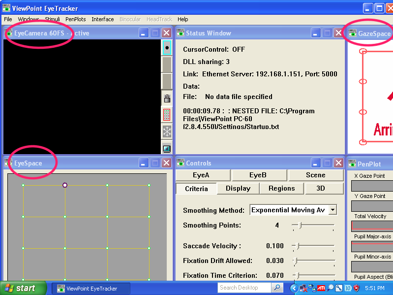
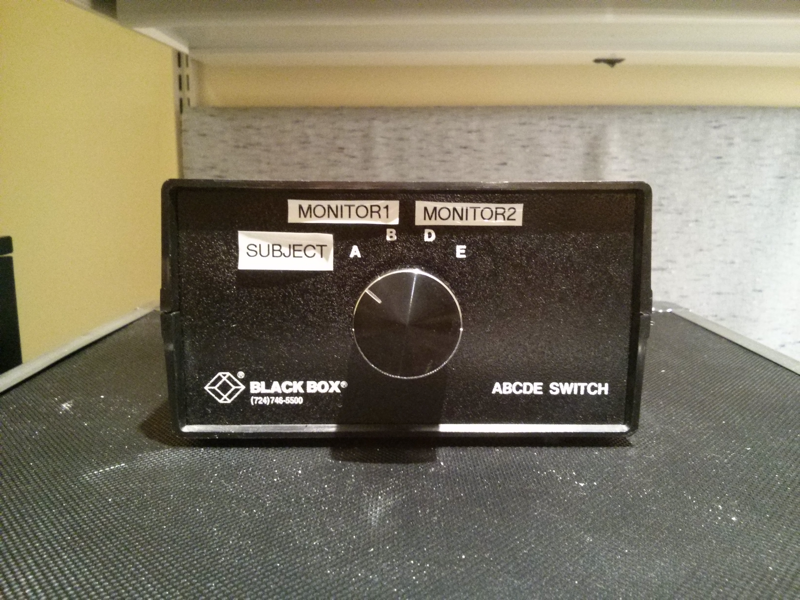
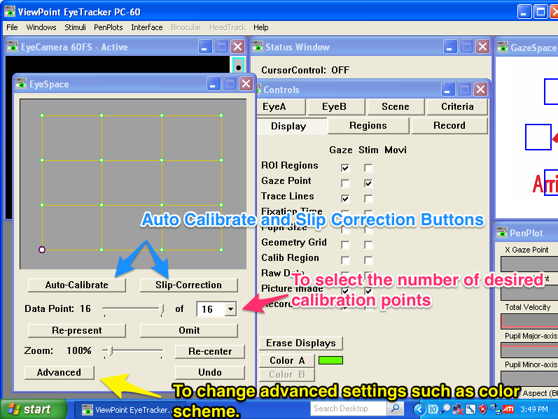
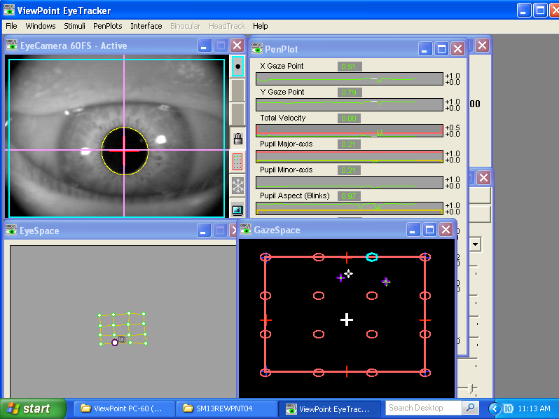
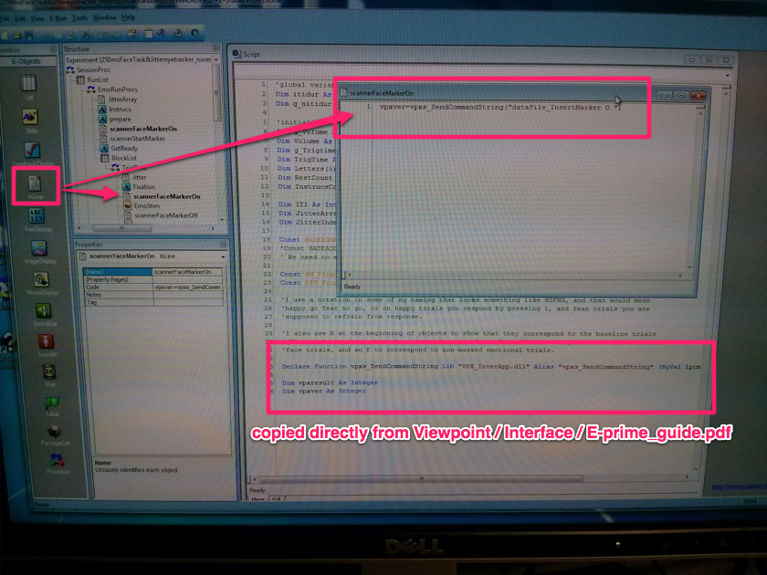
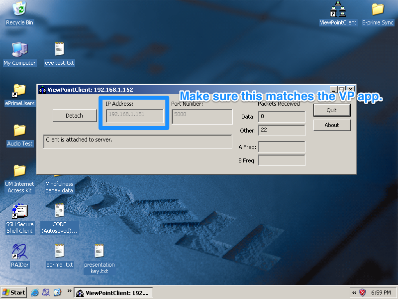
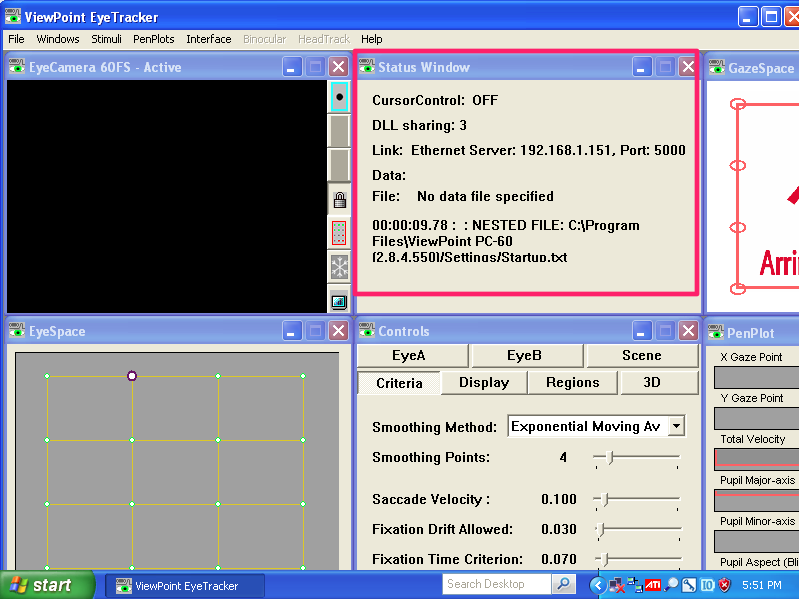

VA Scanner Eye-Tracking User's Manual
=======================
ver. 0.2 (_Prepared by Evan Gennrich & Sean Ma. Questions or suggestions please address to Sean Ma_: **tehsheng@umich.edu**) 

1. Hardware Specs
--------------
### Nordic Neuro Lab EyeTracking Camera

The EyeTracking Camera System consists of three components:

1. EyeTracking Camera: an MR-compatible camera that can be connected to the software for capturing video of the subject's eye.

2. Shielded Interface Unit: A Unit that contains control electronics for the EyeTracking Camera and a Fiber Transmitter.

3. Fiber Receiver: Converts the optical signal coming from the magnet room into an electrical composite video signal.

2. Software Specs
---------------
### Arrington ViewPoint EyeTracker

Description: The ViewPoint EyeTracker provides a complete eye movement evaluation environment including intergrated stimulus presentation, simultaneous eye movement and pupil diameter monitoring, and a Software Developer's Kit (SDK) for communicating with other applications. It incorporates several methods from which the user can select to optimize the system for a particular application. It provides several methods of mapping poition signals extracted from the segmented video image in EyeSpace coordinates to the participant's point of regard in GazeSpace. 

3. Starting the eye-tracking software
------------
1. Turn on the eyetracking computer (computer to the right).

2. Login 'fMRI User' on the login page.

3. Ensure that the computer resolution is 800x600. If not, go to Control Panel >> Display Setting >> Settings >> ScreenResolution Scrollbar >> 800x600

4. On Desktop upper left corner, click on **"Shortcut to ViewPoint"** icon to start the eye-tracking software.

5. Below shows the **default** Viewpoint software window after it's opened (_**Note: Due to screen resolution at 800x600, portions of the software are not shown**_). The 3 crucial windows for general eye-tracking purpose will be: 
  * _**EyeCamera**_
  * _**EyeSpace**_
  * _**GazeSpace**_

   

4. Calibrating eye space with stimulus space
------------
In order to establish a relationship between what the eye is seeing (**eye space**) onto the presented stimulus (**stimulus space**), calibration is needed. Below are the steps: 

1. After Nita has adjusted the clarity of the goggle for the subject (close left eye, see with right eye test), switch the **screen switch box** knob (shown below) to **"D"** position. This will project the **ViewPoint** computer screen onto the goggles. 

   

2. Ask Nita to help on minor adjustment so that the subject's eye is fully center in the **EyeCamera** window. Make sure again the subject sees the whole screen clearly.

3. Drag out the **EyeSpace** window in ViewPoint, choose the number of calibration points you would like to use. Using 12 or 16 points is optimal. 
  * If you would like to change the color scheme of the calibration procedure, click **Advanced** at the bottom of the EyeSpace window. For our purposes, we use a black background and red calibration points.
  
   
  
4. Instruct the subject to regarding the calibrating. Click **Auto-Calibrate** to start.
  * Shown below is a successful calibration. In the **EyeSpace** window the green dots connected by yellow lines are the calibrated result mapped onto the 16 point calibration grid. The result is relatively rectilinear with well separated configuration of dots.
  
  * You can recalibrate a **specific point** by clicking on the **"point of interest"**(highlighted white dot) and click **"Re-present"** button if the specific point is **NOT** aligned in the grid shape formation.
  
   

  * During the scan, the position of the subject's head might slip from the initial position. This will cause a bias shift for the eye-tracking software. It is necessary to perform a __Slip Correction__ at this point. A slip correction takes a sample of the current position of one or more points and repositions the calibrated space accordingly.


5. Collecting eye data in E-prime
-----------------------------------
ViewPoint is constantly logging eye data, including gaze position and pupil size, in its data stream output. To markup task related time entries, the goal is to insert a marker into ViewPoint's data stream before and after the task stimulus is presented to the subject. This will allow user's to capture meaningful task related data for later analysis.

To begin, copy the following the code into your EPrime task: (_**Note: this code serves as a communication glue between E-prime and Viewpoint**_)

```
#Insert into E-Prime task script
Declare Function vpxs_SendCommandString Lib "C:/Documents and Settings/fMRI User/My Documents/ViewPoint2.8.6.21/Interfaces/Windows/ViewPointClient_Ethernet_Interface/VPX_InterApp.dll" Alias "vpxs_SendCommandString" (ByVal lpcmd as String) As Integer

Dim vpxresult As Integer
Dim vpxver As Integer
```

Create two additional scripts in E-prime from below. Place them before and after the stimulus shown in the example below.

```
#Insert as inline object before stimulus presentation
vpxver=vpxs_SendCommandString("dataFile_InsertMarker O")
```
```
#Insert as inline object after stimulus presentation
vpxver=vpxs_SendCommandString("dataFile_InsertMarker X")
```

  * 


6. Collecting eye data in ViewPoint with E-prime synchronization
------------------------------
This saves the data stream into a file in ViewPoint and initiates the communication between E-prime and ViewPoint so that markers can be embedded into the ViewPoint data stream precisely.

1. In ViewPoint, click **"File > Data > New Data File"**. Type in the filename to save and make sure to change the **"Save as type** into **"Tab Delimited Text (*.txt)"**. This will start saving the data stream into the text file.

2. On the E-prime computer, click the icon **"Shortcut to ViewPointClient"** located in the upper right corner of the desktop. The following window will be displayed:

   
   
3. Make sure the IP address is **192.168.1.151** (this should not change, but if so, verify the **"Status Window"** in **ViewPoint** shown below to confirm the ip address matches). Click the **"Attach Server"** button to start synchronization between the two computers and remember to click the **"Detach"** button after data collection is done. 

  * If the __Data__ field is 0, or remains constant, check to see that Viewpoint isn't in Freeze mode by clicking the menu: __Interface > Send Data > Streaming Data__

   
